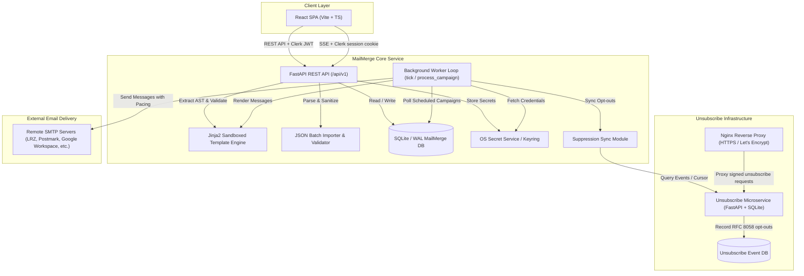

# Local Mail Merge - Architecture & Developer Reference

This document provides a technical overview of the system architecture, database models, background processing pipeline, security guarantees, and extension points for future development.

---

## Architecture Diagram



---

## Core Components & Module Breakdown

| Module | File Path | Responsibility |
|---|---|---|
| **API Router** | [`src/mailmerge/api.py`](file:///home/haris/git/mailclient/src/mailmerge/api.py) | REST API endpoints for campaigns, profiles, JSON recipients, previews, preflight, scheduling, test email dispatch, and SSE events. |
| **Worker Engine** | [`src/mailmerge/worker.py`](file:///home/haris/git/mailclient/src/mailmerge/worker.py) | Background task loop managing campaign state transitions, working hours guardrails, inter-message pacing, SMTP connection management, retry backoff, and periodic suppression sync. |
| **Template Engine** | [`src/mailmerge/rendering.py`](file:///home/haris/git/mailclient/src/mailmerge/rendering.py) | Jinja2 sandboxed execution with `StrictUndefined`, AST undeclared variable extraction, HTML/Markdown conversion, and custom filters (`lower`, `upper`, `title`, `trim`, `default`, `email`). |
| **JSON Importer** | [`src/mailmerge/json_import.py`](file:///home/haris/git/mailclient/src/mailmerge/json_import.py) | Parses flat or nested JSON arrays, normalizes/deduplicates emails, extracts keys, and verifies template variable completeness. |
| **Suppression Sync** | [`src/mailmerge/suppression.py`](file:///home/haris/git/mailclient/src/mailmerge/suppression.py) | Synchronizes unsubscribe events from the unsubscribe microservice (via HTTP API or local SQLite) and marks matching recipients as suppressed. |
| **Message Builder** | [`src/mailmerge/messages.py`](file:///home/haris/git/mailclient/src/mailmerge/messages.py) | Constructs MIME multipart emails with plain-text fallback, attachments, customized `Reply-To`, and RFC 8058 `List-Unsubscribe` headers. |
| **SMTP Client** | [`src/mailmerge/smtp.py`](file:///home/haris/git/mailclient/src/mailmerge/smtp.py) | SMTP connection establishment (`STARTTLS`, `SSL`, `Plain`), SASL authentication (Password, OAuth2 Bearer), and error classification (transient vs permanent). |
| **Secret Management** | [`src/mailmerge/secrets.py`](file:///home/haris/git/mailclient/src/mailmerge/secrets.py) | Interface for persisting and retrieving SMTP credentials via Python `keyring` (Secret Service on Linux, Keychain on macOS). |
| **Unsubscribe Service** | [`src/unsubscribe_service/main.py`](file:///home/haris/git/mailclient/src/unsubscribe_service/main.py) | Standalone microservice receiving HTTP GET/POST unsubscribe requests, verifying HMAC tokens, and recording opt-out timestamps in a local SQLite DB. |
| **Frontend UI** | [`frontend/src/main.tsx`](file:///home/haris/git/mailclient/frontend/src/main.tsx) | React SPA built with Vite and TypeScript for managing campaigns, viewing previews, inspecting JSON variables, running preflight checks, and monitoring real-time dispatch progress. |

---

## Database Schema & Models

Database management is handled via SQLAlchemy 2.0 with SQLite in WAL mode:

### 1. `Campaign` ([`models.py:Campaign`](file:///home/haris/git/mailclient/src/mailmerge/models.py#L50))
- `id`: String (UUID PK)
- `name`: String(200)
- `purpose`: `"operational"` | `"marketing"`
- `profile_id`: FK -> `profiles.id`
- `from_name`, `from_address`, `reply_to`: String
- `subject_template`, `body_template`: Text (Jinja2)
- `body_mode`: `"markdown"` | `"html"`
- `state`: Enum (`draft`, `scheduled`, `sending`, `paused`, `completed`, `cancelled`, `failed`, `awaiting_confirmation`)
- `delay_seconds`: Integer (Nullable) - delay between message dispatches
- `working_hours_enabled`: Boolean
- `working_hours_start`, `working_hours_end`: Integer (0–23)
- `working_hours_timezone`: String (e.g., `"Europe/Berlin"`, `"UTC"`)
- `consent_acknowledged`: Boolean
- `suppression_synced`: Boolean
- `unsubscribe_base_url`: String(500)
- `scheduled_at`: DateTime (UTC)
- `guardrail_override`: Boolean

### 2. `Recipient` ([`models.py:Recipient`](file:///home/haris/git/mailclient/src/mailmerge/models.py#L74))
- `id`: String (UUID PK)
- `campaign_id`: FK -> `campaigns.id` (Indexed, Cascade Delete)
- `email`: String(320)
- `normalized_email`: String(320)
- `values`: JSON (Dict of per-recipient template parameters)
- `included`: Boolean (True if included in dispatch)
- `valid`: Boolean (False if email format is invalid or missing variables)
- `validation_error`: Text (Details of invalidity)
- `suppressed`: Boolean (True if opted-out)
- `status`: String (`"pending"`, `"retry"`, `"sent"`, `"failed"`)
- `message_id`: String (SMTP Message-ID header)
- `sent_at`: DateTime (UTC)
- *Unique Constraint*: `("campaign_id", "normalized_email")`

### 3. `Profile` ([`models.py:Profile`](file:///home/haris/git/mailclient/src/mailmerge/models.py#L28))
- `id`: String (UUID PK)
- `name`: String(200)
- `smtp_host`, `smtp_port`, `security`, `verify_tls`, `username`, `auth_type`
- `daily_cap`: Integer (Default: 250)
- `delay_seconds`: Integer (Default: 2)
- `max_message_bytes`: Integer (Default: 20 MB)
- `reply_to`, `list_unsubscribe`, `list_unsubscribe_one_click`: Optional overrides
- `working_hours_enabled`, `working_hours_start`, `working_hours_end`, `working_hours_timezone`: Default schedule

### 4. `DeliveryAttempt` & `AuditLog`
- Tracks all individual SMTP dispatch attempts, retry timestamps (`retry_at`), SMTP response codes, and lifecycle actions for compliance and debugging.

---

## Worker Execution & Scheduling Loop

The worker (`mailmerge.worker.run`) executes in a dedicated process:

1. **Periodic Tick (`worker.tick()`)**:
   - Queries `SyncCursor` and synchronizes recent unsubscribe events to update `recipient.suppressed = True`.
   - Queries `Campaigns` where `state == CampaignState.scheduled`.
   - Checks if `scheduled_at` is due (or overdue >5 min -> `awaiting_confirmation`).
   - For each due campaign, calls `process_campaign(campaign_id)`.

2. **Campaign Processing (`worker.process_campaign()`)**:
   - Checks **Working Hours Window** (`is_within_working_hours`). If outside active hours (e.g. night or weekend), yields execution until next window.
   - Connects to SMTP and authenticates using stored credentials from Keyring.
   - Iterates through sendable recipients (`included`, `valid`, `~suppressed`, `status IN ('pending', 'retry')`).
   - Renders message with Jinja2 sandbox and builds MIME payload.
   - Dispatches message via SMTP.
   - On success: marks `status = 'sent'`, records `sent_at`, and adds `DeliveryAttempt(outcome='sent')`.
   - On transient failure: schedules retry backoff (delays: 60s, 300s, 900s).
   - Sleeps for `campaign.delay_seconds` (or `profile.delay_seconds`) before sending the next recipient.
   - When all recipients are processed: sets campaign state to `completed`.

---

## Security & Privacy Design Principles

1. **Loopback Binding**: The FastAPI application binds exclusively to `127.0.0.1` by default.
2. **Clerk Authentication**: API requests require a verified Clerk JWT supplied as a bearer token or through Clerk's same-origin `__session` cookie. The application no longer creates or accepts its former local session token.
3. **OS Keyring Integration**: Passwords and OAuth tokens are never written to SQLite or configuration files. They reside in the OS secure credential store.
4. **No Tracking Pixels or URL Rewrites**: The application does not inject tracking pixels, open beacons, or redirect tracking links, guaranteeing complete recipient privacy.
5. **Signed Unsubscribe URLs**: HMAC-SHA256 signatures ensure tokens cannot be forged or enumerated by third parties.

---

## Testing & Quality Assurance

The test suite uses `pytest` and `pytest-asyncio`:

```bash
# Run all tests
.venv/bin/pytest

# Run tests with verbose output
.venv/bin/pytest -vv

# Build the React frontend
cd frontend && npm run build
```

---

## Extension Guidelines for Developers

- **Adding Custom Template Filters**: Extend `ENV.filters` in [`src/mailmerge/rendering.py`](file:///home/haris/git/mailclient/src/mailmerge/rendering.py#L25).
- **Custom Authentications / Transports**: Add new auth drivers in [`src/mailmerge/smtp.py`](file:///home/haris/git/mailclient/src/mailmerge/smtp.py).
- **Custom Export / Webhooks**: Audit logs and delivery attempts can be piped to structured log aggregators or webhook receivers in [`src/mailmerge/worker.py`](file:///home/haris/git/mailclient/src/mailmerge/worker.py).
